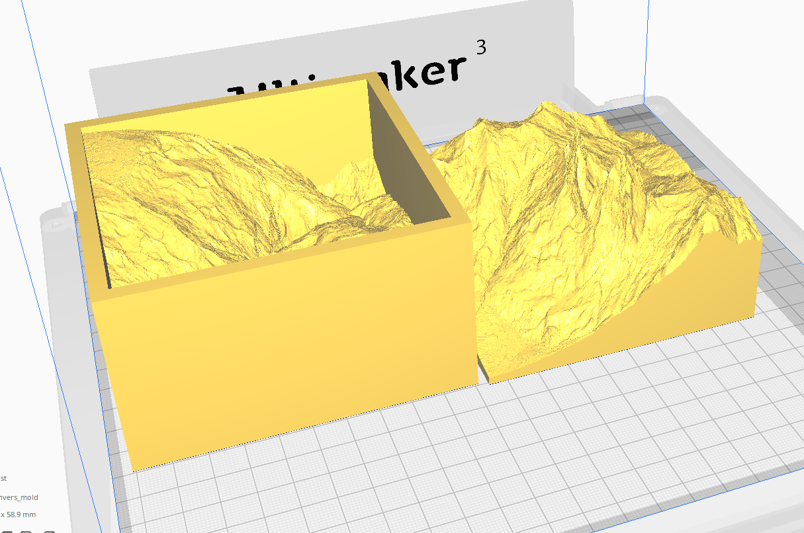

# 34_mountain2modell

<center></center>

Create a 3D inverse mold.

## Requirements

### Repository lokal klonen

1. Navigate to workspace

```python
cd /path/to/workspace
```

2. clone repository

```python
git clone https://github.com/loopercamera/34_mountain2modell.git
```

### Python-Requirements

Following python requirements are needed.

- Python 3.8.19
- requests
- tqdm

Die Module können über das **requirements.txt** im gewünschten Prompt

1. Create a python environment:

```bash
conda create -n my_env python=3.8.19 -c conda-forge --file path/to/requirements.txt
```

2. Select area of interest:

<video width="100%" height="auto" controls>
  <source src="video/Download_alti_3D_Link.mp4" type="video/mp4">
</video>

3. Copy the links to the file `download_list_swissALTI3D.csv`:

4. Start download process

```bash
python alti_3d_downloader.py
```

## QGIS plugin installation

1. Open QGIS-project `mountain2modell_QGIS_Projek.qgzt`
2. Open plugin --> Manage and Install Plugins..
3. Under ALL search:

```
DEMto3D
```

<video width="100%" height="auto" controls>
  <source src="video/Install_QGIS_plugin_DEMto3D.mp4" type="video/mp4">
</video>

4. Install Plugin
5. Close the window plugin

## QGIS merge TIF into one File

1. Open Raster --> miscellaneous --> Merge --> three points (left side)
2. `Add Directory` --> navigate to the folder `TIF_download`
3. All TIF files should be checked now
4. Run
5. The downloaded TIF File are now merged into one File. The file is not saved, it is only temporary
6. Close

## Clip to the preferred cutout

1. Layer --> Create Layer --> New temporary scratch layer
2. Name it
3. Set the geometry Type to `Polygon`
4. OK
5. Add polygon
6. Select a shape, linke square, circle oder polygon
7. Draw the the are an the map an finish with right click
8. End editing
9. Raster --> Extraction --> Clip Raster by Mask Layer
10. Set the input layer to the bevor merged raster layer
11. Set the mask layer to the layer with your preferred cutout
12. Run
13. Close

<video width="100%" height="auto" controls>
  <source src="video/Clip_raster.mp4" type="video/mp4">
</video>

## Save clipped layer

1. Right click on the clipped layer --> Export --> Save As...
2. File name --> three points (left side)
3. Navigate into folder `TIF_merge`
4. Name the file
5. Save
6. OK
7. Select the files create bevor and remove them
8. Select the saved file --> right click --> Properties --> Transparency
9. Under No Data Value --> Additional no data value
10. Set the Value to `0`
11. OK

<video width="100%" height="auto" controls>
  <source src="video/Save_TIF.mp4" type="video/mp4">
</video>

## Create a STL file

1. Open the plugin `DEM 3D printing`
2. Select the TIF layer
3. Click the button `Select full extent` (it may take a while)
4. Set spacing spacing
5. Set the size
6. Set the Height lower than to lowest point to create a base
7. Export STL
8. Navigate into folder `STL`
9. Save (it may take a while)

<video width="100%" height="auto" controls>
  <source src="video/Clip_raster.mp4" type="video/mp4">
</video>

## Create a negativ in Blender

Don't work with circles. With big models, Blender needs some time to process. So patience is needed.

1. Open the blender project `mountain2modell_blender_Projekt.blend`
2. File --> Import --> STL
3. Add Cube (Shift + a)
4. Set the scale in the X and Y-axis,
5. Select the terrain and set the origin to geometry (right click --> Set Origin --> Geometry to origin)
6. Grab the terrain and move it up in the Z-Axis at the same hight as the cube. (Prss g after that z to move the object along the axis)
7. Select the Cube move it in the Z-Axis, so that the terrain is locking throw the cube.
8. Chance to modeling
9. Select the upper face and extrude it over the tip of the terrain. (press e)
10. Change back to layout
11. Add modifier `boolean`, difference and select the terrain
12. Apply to all
13. Select the terrain and delete it
14. Select the cube and rote it in the Y-Axis 180 degree (press g , z and enter 180)
15. Grab the cube and move it up the Z-Axis (press g, z)
16. Export the cube as STL file ( File --> Export --> STL)

<video width="100%" height="auto" controls>
  <source src="video/Blender_inverse_mold.mp4" type="video/mp4">
</video>
